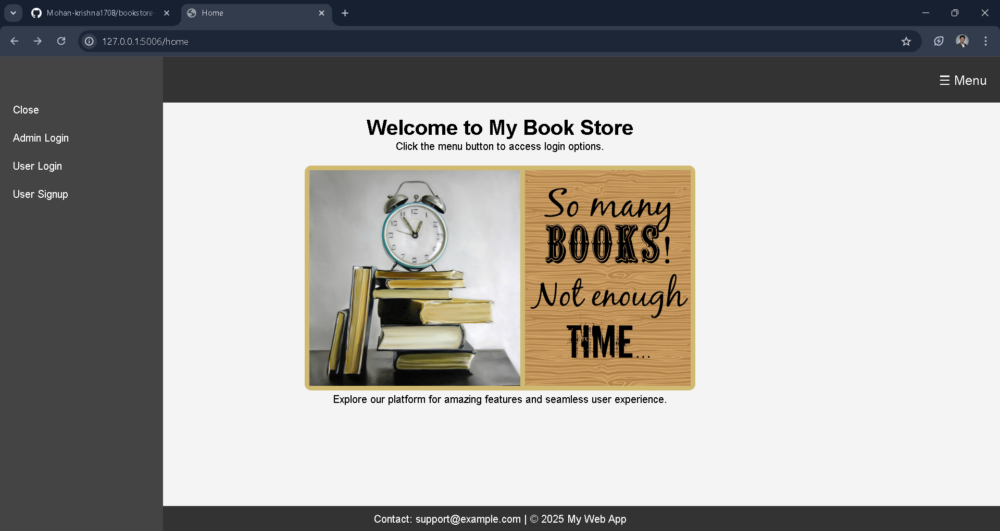
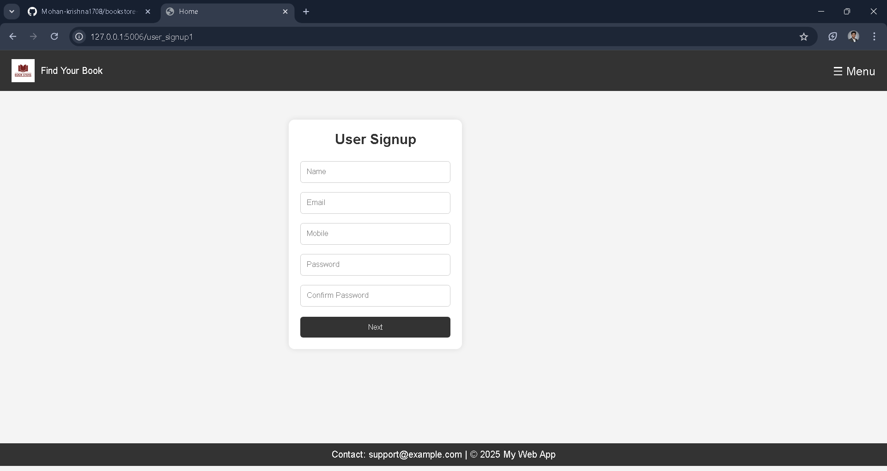
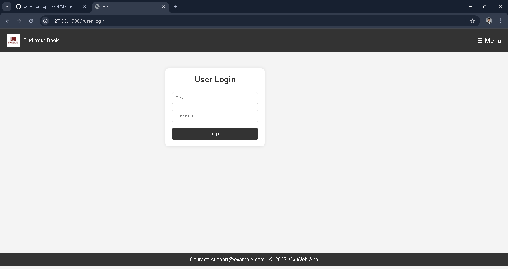
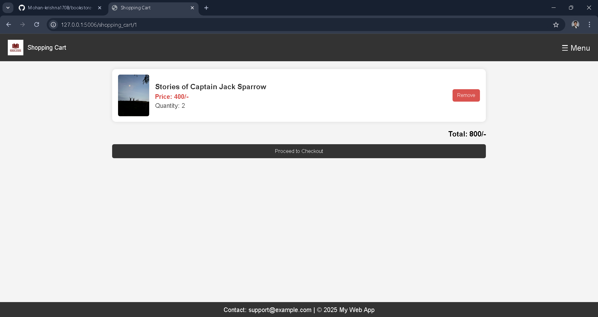

# 📚 Book Store Web Application

A full-stack Book Store web application built using **Flask**, **MySQL**, and **HTML/CSS**.
Users can browse books, add to cart, and place orders. Admin can manage products.

---

## 🚀 Features

### 👤 User

* Signup with OTP (Email)
* Secure Login
* Browse books
* Add to cart
* View cart
* Checkout

### 🛠️ Admin

* Admin login
* Add products
* View/manage products
* Delete products

---

## 🏗️ Tech Stack

* Backend: Flask (Python)
* Database: MySQL
* Frontend: HTML, CSS
* Email: SMTP (Gmail App Password)

---

## 📸 Screenshots

### 🏠 Home Page


### 📝 Signup Page


### 🔐 Login Page


### 📊 Dashboard


### 🛒 Cart


---

## 📁 Project Structure

```
bookstore-app/
│
├── app.py
├── requirements.txt
├── .gitignore
├── README.md
│
├── templates/
├── static/
│   └── images/
│
├── screenshots/
```

---

## ⚙️ Setup Instructions

### 1. Clone repo

```
git clone https://github.com/Mohan-krishna1708/bookstore-app.git
cd bookstore-app
```

### 2. Install dependencies

```
pip install -r requirements.txt
```

### 3. Setup database

* Create MySQL database: `bookstore`
* Update credentials in `app.py`

### 4. Run app

```
python app.py
```

Open:

```
http://127.0.0.1:5006
```

---

## 🔒 Notes

* Do not expose passwords in code
* Use environment variables for email and DB credentials

---

## 👨‍💻 Author

Mohan Krishna

---

## ⭐ Support

If you like this project, give it a ⭐ on GitHub!
